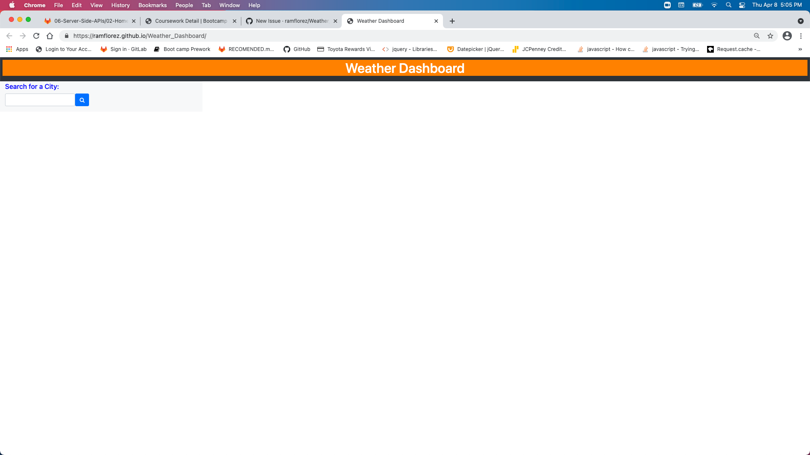
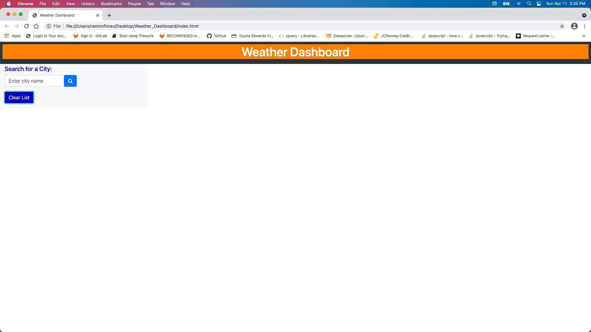
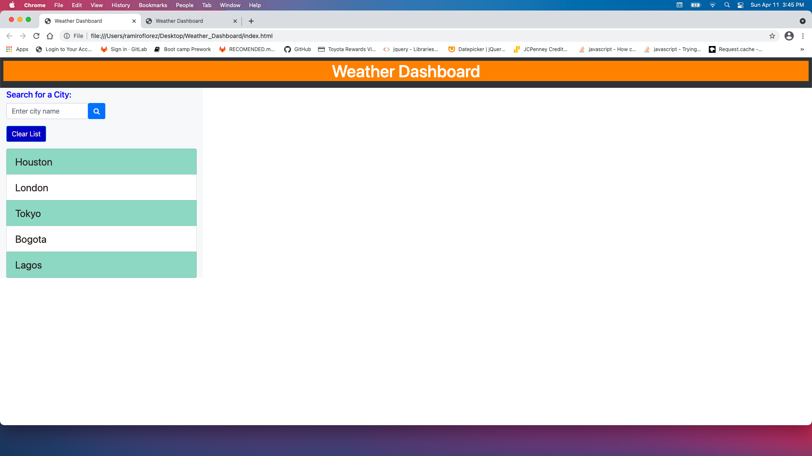

In order to create the # Weather_Dashboard, I follow this flow.
Initially I created the html file with all the elements required like textareas, buttons and all necessary classes and Ids.
I linked my file with a preexisted framework in bootstrap for design, style and even font.
However, I override the style with a CSS file to improve accesibility.
The data was fetched and parsed with a js file.
the API used was openweathermap.org.
User enter a city, clicks the "search" button and receives the weather informaition including uv index.
List of search is kept in local storage. It can be deleted using the "clear List" button.

Here is the link for my deployed page at Github.
https://ramflorez.github.io/Weather_Dashboard/

please see snapshots of the deployed pages below.

