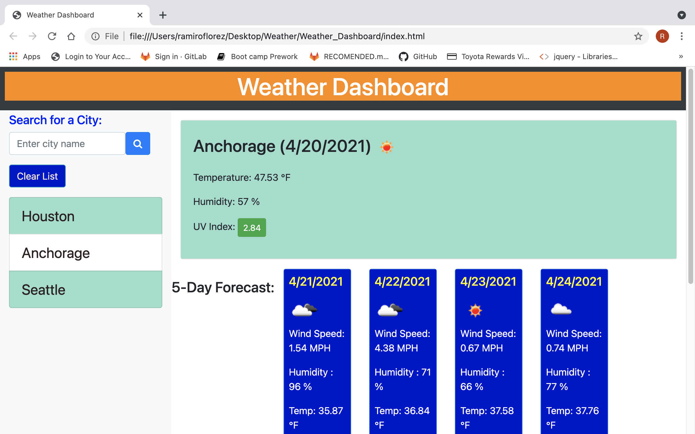
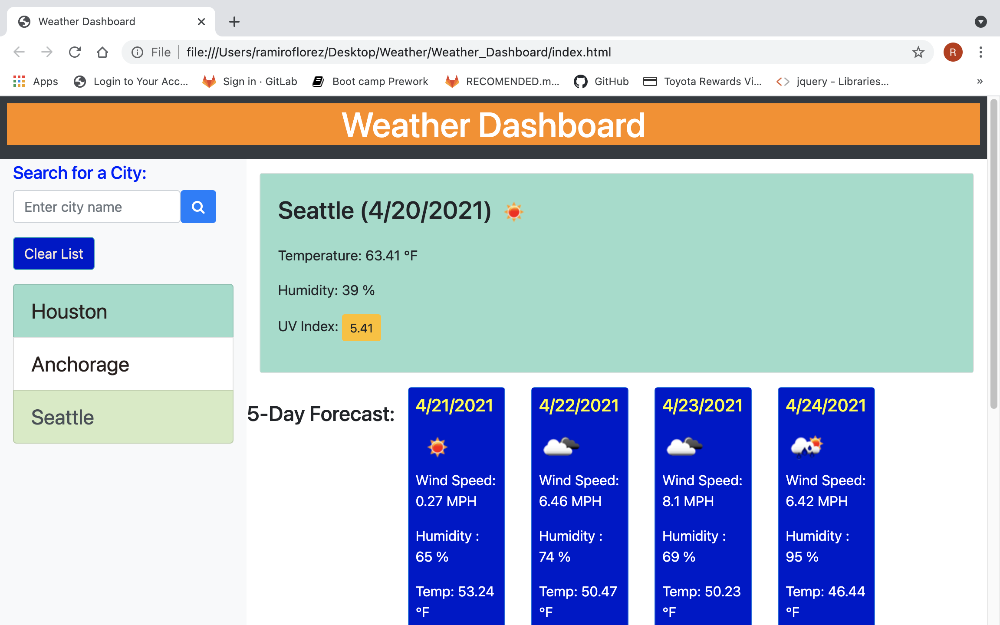
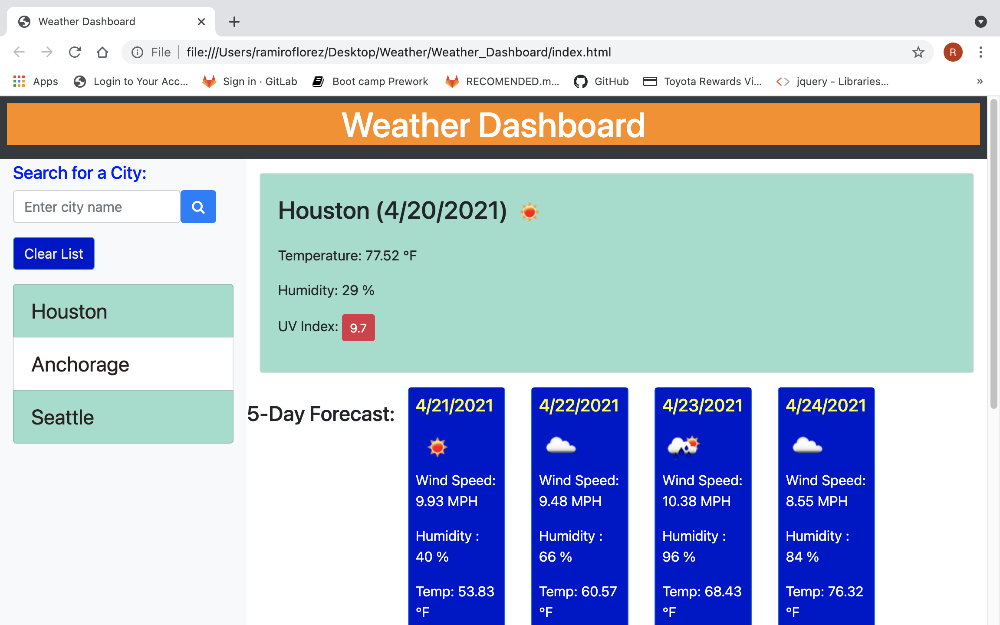

# Weather Dashboard

HTTML, CSS, JS, APIs

ramflorez@yahoo.com

In order to create the # Weather_Dashboard, I follow this flow.
Initially, I created an html file with all the elements required like text areas, buttons and all necessary classes and Ids.
I linked this DOM file with a preexisted framework in bootstrap for design, style and even font.
However, I overrode the style with a CSS file to improve accesibility.
The data was fetched and parsed with a js file.
The APIs used were from openweathermap.org. An individual key was obtained. This individual key was used to call three different APIs: Current Weather API, Forecast API, and UV API. 
Cards and elements like windspeed, humidity, uv index, etc for forecast, current weather and UV were created dinamically in js and were appended to the DOM.
User enters a city, clicks the "search" button and receives the weather information including uv indexes and a 5 days forecast. I used conditionals to change the color of the uv button according to uv indexes from green into orange and red.
The list of searched cities is kept in local storage. It can be deleted using the "Clear List" button.

Here is the link for my deployed page at Github pages.
https://ramflorez.github.io/Weather_Dashboard/

Please see snapshot of the deployed pages below.

Cities searched are kept in local storage.

List of searched cities is cleared by the "Clear List" button.

UV button changes into green according to values.

UV button changes into orange according to values.

UV button changes into red according to values.

