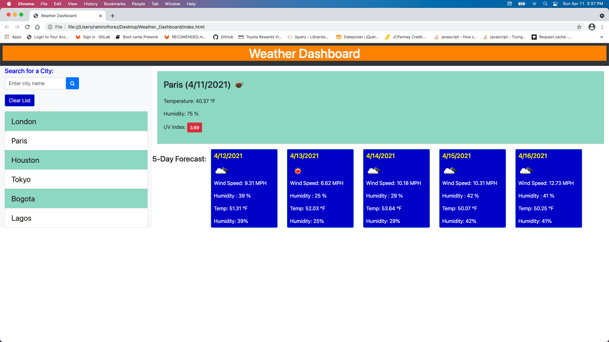

In order to create the # Weather_Dashboard, I follow this flow.
Initially I created the html file with all the elements required like textareas, buttons and all necessary classes and Ids.
I linked my file with a preexisted framework in bootstrap for design, style and even font.
However, I override the style with a CSS file to improve accesibility.
The data was fetched and parsed with a js file.
the API used was openweathermap.org. An individual key was used. However, I called three different APIs. Current Weather, Forecast and UV.
Cards for the forecast were created dinamically in js and elements like windspeed, humidity were appended to the DOM.
User enter a city, clicks the "search" button and receives the weather information including uv index. I used conditionals to change the color of the uv button according to uv indexes from red into orange and red.
The list of searched cities is kept in local storage. It can be deleted using the "Clear List" button.

Here is the link for my deployed page at Github.
https://ramflorez.github.io/Weather_Dashboard/

please see snapshots of the deployed pages below.

